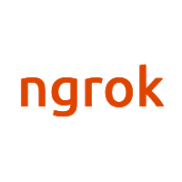
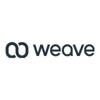

---
# Feel free to add content and custom Front Matter to this file.
# To modify the layout, see https://jekyllrb.com/docs/themes/#overriding-theme-defaults

layout: home
---
<header>
  
</header>
<section>
  <h1>Compile SQL to type-safe Go</h1>
  

    sqlc generates fully-type safe idiomatic Go code from SQL. Here's how it works:
  

  <ol>
    <li>You write SQL queries</li>
    <li>You run sqlc to generate Go code that presents type-safe interfaces to those queries</li>
    <li>You write application code that calls the methods sqlc generated.</li>
  </ol>
  

    Seriously, it's that easy. You don't have to write any boilerplate SQL querying code ever again. Read more in the <a href="https://conroy.org/introducing-sqlc">introduction</a>. 
  

  <h2>Contribute</h2>
  

    Development happens on Github: <a href="https://github.com/kyleconroy/sqlc">https://github.com/kyleconroy/sqlc</a>.
  

  <h2>Downloads</h2>
  <ul class="post-list">
    <li>
      <h3>
        <a class="post-link" href="https://bin.equinox.io/c/gvM95th6ps1/sqlc-devel-linux-amd64.tgz">Linux</a>
      </h3>
    </li>
    <li>
      <h3>
        <a class="post-link" href="https://bin.equinox.io/c/gvM95th6ps1/sqlc-devel-darwin-amd64.zip">macOS</a>
      </h3>
    </li>
  </ul>
  <h2>Sponsors</h2>
  

    
    
    
  

  <h3>Individual Sponsors</h3>
  <ul>
    <li><a href="https://github.com/Cyberax">Alex Besogonov</a></li>
    <li><a href="https://github.com/myles-mcdonnell">Myles McDonnell</a></li>
  </ul>
</section>

